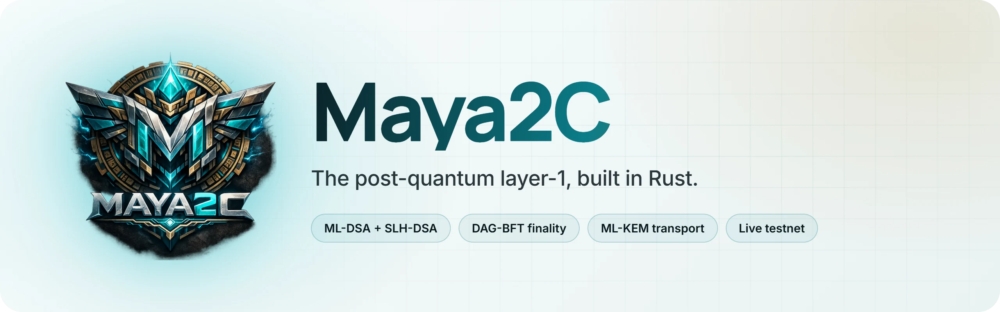
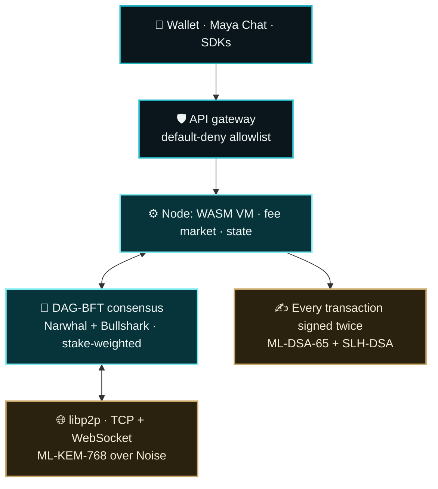

<p align="center">
  <a href="https://maya2c.dev">
    <picture>
      <source media="(prefers-color-scheme: dark)" srcset=".github/assets/banner-dark.webp">
      
    </picture>
  </a>
</p>

<p align="center">
  <a href="https://status.maya2c.dev"></a>
  <a href="https://status.maya2c.dev"></a>
  <a href="LICENSE"></a>
  
</p>

<p align="center">
  <a href="https://maya2c.dev/experience/"><b>✦ Experience it live</b></a> &nbsp;·&nbsp;
  <a href="https://maya2c.dev/guides/testnet/">Join the testnet</a> &nbsp;·&nbsp;
  <a href="https://explorer.maya2c.dev/">Explorer</a> &nbsp;·&nbsp;
  <a href="https://faucet.maya2c.dev/">Faucet</a> &nbsp;·&nbsp;
  <a href="https://status.maya2c.dev/">Uptime</a> &nbsp;·&nbsp;
  <a href="https://maya2c.dev/guides/validators/">Run a validator</a>
</p>

---

## The short version

Every transaction carries **two** signatures — ML-DSA-65 (FIPS 204) and
SLH-DSA-SHA2-128s (FIPS 205) — and both must verify. That is 11,165 bytes per
transaction, which is the price of not betting the chain on one lattice
assumption. Transport is libp2p with an ML-KEM-768 layer over Noise, and an
optional HQC-192 second KEM behind a flag.

**Mainnet is deliberately blocked.** `CIRCUIT_IS_AUDITED` is `false`: the
shielded pool is a transparent STARK with no setup, but its joinsplit AIR has
had no independent audit, and six separate guards refuse a value-bearing chain
id. See
[docs/mainnet-readiness.md](docs/mainnet-readiness.md) — that block is the first
thing to read before anything else here matters.

## How it fits together



## Workspace

<details>
<summary><b>The core crates</b> (click to open)</summary>

| Member | Role |
|---|---|
| *(root)* `custom-l1-node` | Node daemon: consensus, chain, p2p, RPC, metrics |
| `ledger-math` | All `u64` credit/debit/nonce math. Kani-verifiable — no C/C++ in its graph |
| `crypto-pq` | SLH-DSA instantiation. Must stay the monomorphizing crate |
| `zk-stark` | Plonky3 STARKs: shielded joinsplits, credentials, sanctions proofs |
| `vm` | Wasm contract execution |
| `l2-flash` | L2 settlement |
| `wallet`, `apps/wallet-gui/` | CLI wallet, and a Tauri desktop wallet whose keys never leave the Rust core |
| `explorer` | Server-rendered chain explorer |
| `cuda-miner`, `wgpu-miner` | GPU miners. Both GPU features are default-off so CI builds without an adapter |
| `stratum-v2`, `pool-service` | Pool protocol, and the daemon joining it to chain types |
| `dex` | Constant-product curve, order book matcher, batch clearing. Dependency-free |
| `vrf` | RFC 9381 EC-VRF behind the randomness beacon |
| `governance` | Proposal lifecycle and the bounds a proposal may never escape |
| `faucet` | Testnet faucet. A hot wallet on a public endpoint — see its doc before deploying it |
| `telemetry` | Network telemetry collector, split into `server` and `client` halves |
| `light-client` | SPV header fork choice and state-proof verification |
| `mev` | Threshold-encrypted mempool: a miner orders transactions it cannot read |
| `custody-mpc` | Threshold custody of a chain key: dealerless VSS, ML-KEM-sealed shares, quorum signing |
| `archive` | CAR v1 (zstd) archives of pruned block batches: local dir, IPFS, Arweave |
| `api-gateway` | REST and GraphQL gateway, talking to a node over JSON-RPC |
| `sdk-ffi`, `sdk-wasm` | uniffi bindings, and browser bindings, over the hybrid signing primitives |
| `docgen` | Generates the LaTeX technical reference from module documentation |
| `apps/dashboard/` | Leptos browser page. Not a workspace member: CSR Leptos only runs on `wasm32` |

</details>

### Research branches

These crates are in the tree and tested, but **no consensus path calls them**. Each is
dark behind an activation height of `u64::MAX`, or is off-chain entirely. The
rationale for each is in
[docs/architecture-vision.md](docs/architecture-vision.md).

<details>
<summary><b>The research crates</b> (click to open)</summary>

| Member | Role |
|---|---|
| `fee-market`, `neural-gas-trainer` | EIP-1559 base fee over bytes, plus an integer neural gain inside a Kani-proved envelope, and the off-chain trainer for that gain |
| `blockgraph` | Narwhal/Tusk batch references and deterministic shard scheduling |
| `lattice-pow` | Lattice proof-of-useful-work (SVP) verification |
| `zkml`, `zkml-prover` | halo2 proofs of quantized-classifier inference: the verifier, and the off-chain prover |
| `rwa`, `identity` | Real-world assets and self-sovereign identity (DIDs, selective disclosure) |
| `iso20022` | ISO 20022 bank-rail messages bridged to payment intents |
| `radio-transport` | Off-grid LoRa framing, a duty-cycle governor, a fountain codec |
| `htlc-lattice`, `htlc-watcher` | Lattice HTLC atomic swaps (Maya2C↔Maya2C only), and the counterparty watcher |
| `stateless-core` | Sparse-Merkle account witnesses for stateless transfer verification |
| `confidential-ai` | Federated training with ML-KEM secure aggregation and integer differential privacy |
| `ebpf-net`, `hal/ebpf-net/common` | UDP block relay judged by an XDP program at the driver (Linux, `xdp` feature) |
| `threat-intel`, `threat-firewall` | Threat indicators built from verifiable gossip evidence, and the per-host nftables worker |
| `iot-anchor` | Hardware-anchored sensor identity: ML-DSA-65 device keys, PUF, TPM sealing, hash-chained telemetry batches. `no_std`; `hal/iot-firmware/` runs it on Cortex-M33 under QEMU |

</details>

Three more directories have their own workspaces and toolchains: `offsec-sandbox/`
(red-team fuzzing), `hal/ebpf-net/programs/` (the XDP program) and `fuzz/`.

## Run the whole ecosystem locally

```sh
cargo xtask up      # 4 validators (DAG-BFT), API gateway, chat relay, funded wallet
cargo xtask down    # stop exactly what `up` started
```

`up` builds what it needs, waits until the validators agree on a chain and
every service answers, then prints the endpoints (also in
`target/up/up.json`). It is a local devnet: keys are generated fresh each
time and everything listens on 127.0.0.1 only. Run it in a terminal. On
Windows the services it leaves running inherit a piped stdout, so
`cargo xtask up | ...` waits until `down`; redirect to a file instead.

## Build

Requires Rust 1.88 (edition 2024).

```bash
cargo build --workspace
cargo nextest run --workspace      # nextest is the primary runner
cargo clippy --workspace --all-targets
cargo deny check
```

The first build after a clean is long: `[profile.dev.package.*]` overrides
compile the crypto and arkworks stacks optimized even in debug, which is
load-bearing rather than tuning — without them `cargo test` reads as hung.

### The browser frontends

Both are built with [`trunk`](https://trunkrs.dev) and live outside the Cargo
workspace's test surface:

```bash
cd dashboard      && trunk build --release   # telemetry dashboard
cd apps/wallet-gui/ui  && trunk build --release   # wallet frontend
```

## Documentation

[docs/README.md](docs/README.md) indexes the full set. The ones to read first:

- [mainnet-readiness.md](docs/mainnet-readiness.md) — why mainnet is blocked
- [launch-checklist.md](docs/launch-checklist.md) — what remains before a
  value-bearing launch
- [hybrid-signatures.md](docs/hybrid-signatures.md) — the two-signature scheme
- [security-audit.md](docs/security-audit.md)

## Branding

Logo assets live in [`logo-assets/`](logo-assets/) and are the source of truth.
Two scripts deploy them, and both take `--check` so drift is detectable rather
than discovered:

```bash
python scripts/deploy_brand_assets.py        # favicons and wordmarks into each app
python scripts/make_og_card.py               # the 1200x630 social card
cargo tauri icon logo-assets/print/HighRes-Square-2000_2000x2000.png \
  -o apps/wallet-gui/src-tauri/icons               # the desktop icon set
```

## Status

This is pre-launch software on a chain that refuses to be worth anything. Read
`CLAUDE.md` for the invariants that are load-bearing before changing consensus,
crypto, or ledger code.

## License

Apache License 2.0: see [LICENSE](LICENSE) and [NOTICE](NOTICE). You may use,
modify and distribute this code, including commercially, under its terms,
which include an express patent grant.

The cryptography has **not** been independently audited. Mainnet is blocked
until it has been (see [docs/mainnet-readiness.md](docs/mainnet-readiness.md)).
